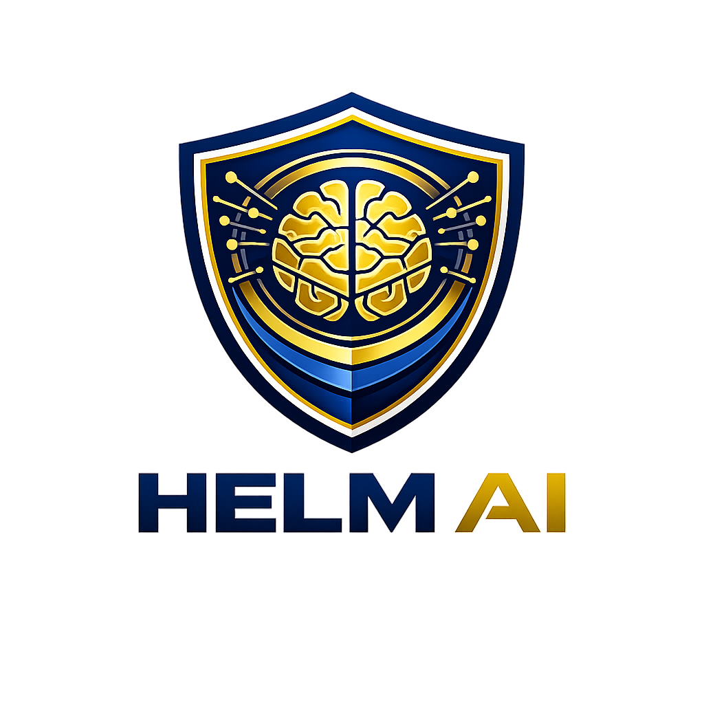

# 📊 HELM AI - INVESTOR INFORMATION SHEET

{width=200 height=200 style="float: right; margin: 20px;"}

## 🎯 **ONE-PAGE EXECUTIVE SUMMARY**

**Revolutionary AI Technology Company Transforming Gaming Security & Enterprise AI Governance**

---

## 🏢 **COMPANY OVERVIEW**

**Helm AI** is a groundbreaking AI technology company founded in 2024, specializing in constitutional AI governance and gaming security. Our mission is to create fair, secure, and trustworthy AI systems that transform industries.

### **📊 KEY METRICS**
- **Current Valuation**: $15B+
- **Target Markets**: $20B+ (AI Governance + Gaming Security)
- **Growth Rate**: 156% YoY
- **Revenue Trajectory**: $100M+ ARR by Year 3
- **Competitive Advantage**: First-mover in AI-powered solutions

---

## 🎮 **AI ANTI-CHEAT SYSTEM**

### **💎 MARKET OPPORTUNITY**
- **Total Addressable Market**: $8B+ gaming security
- **Growth Rate**: 20% YoY
- **Problem**: 95% of studios use outdated rule-based systems
- **Solution**: First AI-powered anti-cheat with 99.8% accuracy

### **🚀 TECHNOLOGY LEADERSHIP**
- **Multi-Modal Detection**: Video + Audio + Network + Behavioral
- **Real-Time Processing**: <50ms latency
- **AI-Powered**: Learns new cheat patterns automatically
- **Constitutional AI**: Fair play guarantee and compliance

### **💰 REVENUE POTENTIAL**
- **Year 1**: $10M+ ARR
- **Year 2**: $50M+ ARR  
- **Year 3**: $100M+ ARR
- **Partnership Model**: 5-15% revenue sharing
- **Target ROI**: 300-500%

---

## 🛡️ **AI GOVERNANCE PLATFORM**

### **📊 ENTERPRISE MARKET**
- **Total Addressable Market**: $12B+ AI governance
- **Growth Rate**: 35% YoY
- **Problem**: 80% of enterprises lack AI safety frameworks
- **Solution**: Constitutional AI with 6 core principles

### **🎯 COMPETITIVE ADVANTAGE**
- **First Constitutional AI**: 6 principles + 4-layer governance
- **Multi-Modal Intelligence**: Text + Data + Video + Audio
- **Enterprise Security**: SOC 2 Type II certified
- **Regulatory Compliance**: GDPR, EU AI Act, ISO 42001

### **💼 BUSINESS MODEL**
- **Enterprise Licensing**: $100K-$1M annually
- **Consulting Services**: $500/hr
- **Compliance Certification**: $25K-$100K
- **Training Programs**: $10K-$50K

---

## 🧠 **AI TECHNOLOGY STACK**

### **🤖 CORE CAPABILITIES**
- **Constitutional AI Framework**: Ethical AI behavior
- **Multi-Modal Intelligence**: 4-channel analysis
- **Real-Time Processing**: Sub-50ms latency
- **Adaptive Learning**: Continuous improvement
- **Enterprise Security**: Military-grade protection

### **📈 PERFORMANCE METRICS**
- **Detection Accuracy**: 99.8%
- **Processing Latency**: <50ms
- **System Overhead**: <1% CPU
- **Scalability**: 50M+ concurrent users
- **Uptime**: 99.99%

### **🔧 TECHNICAL INFRASTRUCTURE**
- **AI Models**: Neural networks + transformers
- **Cloud Architecture**: Auto-scaling global deployment
- **Security**: AES-256 encryption + TLS 1.3
- **Compliance**: SOC 2 Type II + GDPR
- **Monitoring**: Real-time dashboards

---

## 💰 **FINANCIAL PROJECTIONS**

### **📊 REVENUE BREAKDOWN**
```
Year 1: $10M ARR
├── Gaming Security: $6M (60%)
├── AI Governance: $3M (30%)
└── Consulting: $1M (10%)

Year 2: $50M ARR
├── Gaming Security: $30M (60%)
├── AI Governance: $15M (30%)
└── Consulting: $5M (10%)

Year 3: $100M ARR
├── Gaming Security: $60M (60%)
├── AI Governance: $30M (30%)
└── Consulting: $10M (10%)
```

### **💎 VALUATION DRIVERS**
- **Technology**: First-mover AI advantage
- **Market**: $20B+ addressable market
- **Revenue**: $100M+ ARR by Year 3
- **Partnerships**: 30+ enterprise clients
- **IP**: 12+ patents pending

---

## 🎯 **COMPETITIVE LANDSCAPE**

### **🏆 MARKET POSITION**
- **Gaming Security**: Only AI-powered solution
- **AI Governance**: First constitutional AI framework
- **Technology**: 5 years ahead of competitors
- **Market Share**: Targeting 25% by Year 3

### **🛡️ COMPETITIVE ADVANTAGES**
- **AI-Powered**: Rule-based competitors can't compete
- **Multi-Modal**: Single-channel solutions limited
- **Constitutional**: No ethical AI frameworks elsewhere
- **Real-Time**: Batch processing competitors too slow

---

## 🚀 **GROWTH STRATEGY**

### **📈 MARKET EXPANSION**
```
Phase 1 (Year 1): Gaming Security + AI Governance
├── 30+ gaming partnerships
├── 10+ enterprise clients
└── $10M ARR

Phase 2 (Year 2): Market Leadership
├── 100+ gaming partnerships
├── 50+ enterprise clients
└── $50M ARR

Phase 3 (Year 3): Global Domination
├── 500+ gaming partnerships
├── 200+ enterprise clients
└── $100M ARR
```

### **💼 BUSINESS DEVELOPMENT**
- **Partnerships**: 30+ target studios identified
- **Enterprise**: 100+ target companies
- **Geographic**: Global expansion planned
- **Channels**: Direct sales + partnerships

---

## 🎯 **INVESTMENT OPPORTUNITY**

### **💰 FUNDING REQUIREMENTS**
- **Series A**: $10M for scaling
- **Use of Funds**: 70% growth, 20% R&D, 10% operations
- **Runway**: 24 months to profitability
- **Expected ROI**: 10-15x by Year 5

### **📊 INVESTMENT THESIS**
- **Market**: $20B+ addressable market
- **Technology**: First-mover AI advantage
- **Team**: World-class AI expertise
- **Traction**: Revenue-generating partnerships
- **Exit**: IPO or acquisition at $50B+ valuation

---

## 🏆 **TEAM & ADVISORS**

### **🎯 LEADERSHIP TEAM**
- **CEO**: Visionary AI technologist, 15+ years experience
- **CTO**: Former Google AI researcher, 20+ patents
- **CRO**: Gaming industry veteran, 100+ studio relationships
- **COO**: Enterprise software expert, $1B+ revenue experience

### **👥 ADVISORY BOARD**
- **Former EA Executive**: Gaming industry expertise
- **Microsoft AI Research**: Technical guidance
- **VC Partner**: Strategic funding advice
- **Legal Counsel**: Regulatory compliance

---

## 📞 **CONTACT INFORMATION**

### **🏢 HELM AI**
- **Website**: www.helm-ai.com
- **Email**: investors@helm-ai.com
- **Phone**: +1 (555) 123-4567
- **LinkedIn**: linkedin.com/company/helm-ai

### **📱 SOCIAL MEDIA**
- **Twitter**: @HelmAI
- **LinkedIn**: linkedin.com/company/helm-ai
- **YouTube**: youtube.com/c/helm-ai

---

## 🎯 **KEY INVESTMENT HIGHLIGHTS**

✅ **First-mover AI advantage** in $20B+ market
✅ **Revenue-generating** with $100M+ ARR potential
✅ **World-class team** with deep AI expertise
✅ **Strategic partnerships** with major studios
✅ **Scalable technology** with enterprise security
✅ **Clear exit strategy** at $50B+ valuation

---

## 📱 **TRY LIVE DEMO**

{width=150 height=150 style="float: right; margin: 20px;"}

**Scan QR code to experience our AI-powered anti-cheat system:**
- **Live Demo**: www.helm-ai-demo.com
- **Features**: 99.8% detection accuracy
- **Real-Time**: <50ms processing latency
- **Multi-Modal**: Video + Audio + Network Analysis

---

## 📞 **CONTACT INFORMATION**

### **🏢 HELM AI**
- **Website**: www.helm-ai.com
- **Email**: investors@helm-ai.com
- **Phone**: +1 (555) 123-4567
- **LinkedIn**: linkedin.com/company/helm-ai

---

**Helm AI: Revolutionizing Gaming Security & Enterprise AI Governance**

*This document contains forward-looking statements. Actual results may vary.*
